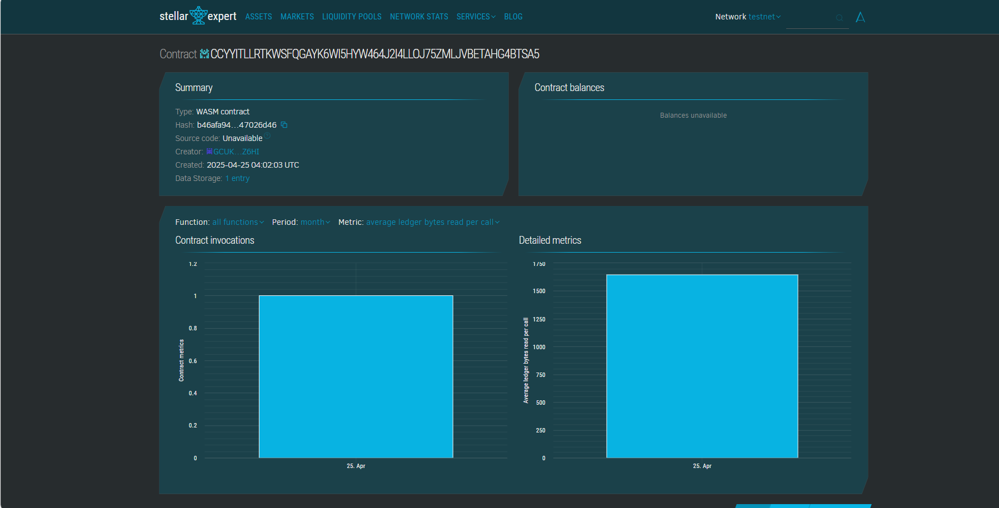

# Automated Hydroponic Farming System

## 📄 Project Description
The Automated Hydroponic Farming System is a decentralized solution powered by the Stellar Soroban smart contracts that enables secure, transparent, and immutable logging of hydroponic farming operations and parameters like plant cycles, nutrient levels, and water usage.

## 🎯 Project Vision
Our vision is to empower futuristic urban farming solutions by integrating blockchain with hydroponic farming. This creates a trustless, efficient, and tamper-proof farming ecosystem for both commercial and domestic growers.

## 🔑 Key Features
- 🌱 Smart Contract-based project information storage (title, description, owner)
- 🔒 Immutable project deployment logs
- ✏️ Ability to update project description while retaining historical integrity
- 📦 Optimized for low storage and high efficiency

## 🚀 Future Scope
- Integration with IoT sensors for real-time environmental data
- Automated alerts and decision-making using smart contracts
- Data analytics dashboard for yield prediction and optimization
- NFT-based crop identity and traceability

#Contract Details
CCYYITLLRTKWSFQGAYK6WI5HYW464J2I4LLOJ75ZMLJVBETAHG4BTSA5

